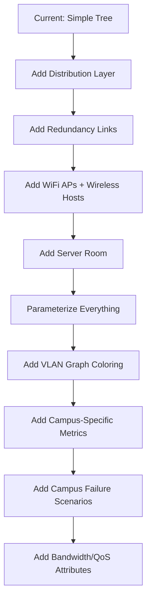

# 🚀 Enhancement Suggestions — Network Topology Analysis Project

This document outlines graph-theory-grounded enhancements for the overall project **and** a deep-dive into the **Campus Network** topology.

---

## Part A — Project-Wide Enhancements

### 1. New Graph Metrics (add to `metrics.py`)

| # | Metric | Graph-Theory Basis | Why It Matters |
|---|--------|--------------------|----------------|
| 1 | **Node Connectivity (κ)** | `nx.node_connectivity(G)` — min nodes to remove to disconnect | Directly measures structural resilience |
| 2 | **Algebraic Connectivity (λ₂)** | Second-smallest eigenvalue of the Laplacian matrix | Quantifies how well-connected the graph is; higher = harder to partition |
| 3 | **Closeness Centrality (avg)** | Average of `1 / sum(shortest_paths)` for each node | Identifies how quickly any node can reach all others |
| 4 | **Degree Distribution (entropy)** | Shannon entropy of the degree sequence | Uniform = robust; skewed = hub-dependent |
| 5 | **Assortativity** | `nx.degree_assortativity_coefficient(G)` | Positive = hubs connect to hubs (resilient); negative = hubs connect to leaves (fragile) |
| 6 | **Average Eccentricity** | Mean of `max shortest path` per node | Better than diameter alone — captures overall "spread" |
| 7 | **Wiener Index** | Sum of all pairwise shortest paths | Classic graph-theory measure of total transmission cost |
| 8 | **Spectral Gap** | Difference between first two eigenvalues of adjacency matrix | Larger gap = faster information diffusion |

### 2. Enhanced Failure Simulation

| Enhancement | Description |
|-------------|-------------|
| **Random Node Failure** | Remove `k` random nodes and measure host connectivity — models unexpected outages |
| **Link Failure Mode** | Remove edges instead of nodes — models cable cuts / link degradation |
| **Progressive Failure Curve** | Remove nodes 1-by-1 (highest betweenness first), plot connectivity vs. failures removed — generates a **resilience curve** |
| **Multi-failure Comparison** | Run failure simulation on 2+ topologies simultaneously and overlay the resilience curves for comparison |

### 3. New Topology Models

| Topology | Graph-Theory Model | Real-World Use |
|----------|--------------------|----------------|
| **Hypercube (n-cube)** | `nx.hypercube_graph(n)` — each node labelled by n-bit binary string | HPC interconnects, parallel computing |
| **Small-World (Watts-Strogatz)** | `nx.watts_strogatz_graph(n, k, p)` — ring lattice with random rewiring | Social networks, IoT mesh |
| **Scale-Free (Barabási-Albert)** | `nx.barabasi_albert_graph(n, m)` — preferential attachment | Internet backbone, power-law degree distribution |
| **DCell** | Recursive: `DCell(0)` = `n` servers + 1 switch; `DCell(k)` = `k+1` copies of `DCell(k-1)` | Modern data-center (serverless switching) |

### 4. Edge Attributes & Weighted Analysis

Currently edges only have `latency`. Add:

| Attribute | Type | Purpose |
|-----------|------|---------|
| **bandwidth** | `int` (Mbps) | Enables max-flow / min-cut analysis |
| **cost** | `float` ($) | Enables total network cost computation |
| **reliability** | `float` (0-1) | Probability edge stays up — enables probabilistic connectivity analysis |

**New metrics this unlocks:**

- **Max Flow** (`nx.maximum_flow`) — between any two hosts, what's the max throughput?
- **Min Cut** (`nx.minimum_edge_cut`) — minimum links to sever to isolate two hosts
- **Total Network Cost** — `sum(cost for all edges)` — direct CapEx comparison
- **Reliability Index** — product of edge reliabilities along shortest path

### 5. Visualization Enhancements

| Feature | Description |
|---------|-------------|
| **Heatmap Overlay** | Color nodes by betweenness centrality intensity (red = bottleneck, green = low load) |
| **Path Highlighting** | Click two hosts → highlight the shortest path between them |
| **Degree Histogram** | Bar chart showing degree distribution of the selected topology |
| **Resilience Curve Chart** | Line chart from progressive failure simulation (host connectivity % vs. # failures) |
| **Hierarchical Layout** | For tree-like topologies (campus, three-tier), use a top-down layered layout instead of force-directed |

### 6. Configurable Topology Parameters (Frontend)

Currently all topologies are hardcoded at startup. Add UI controls:

```
Leaf-Spine:   num_spine, num_leaf, hosts_per_leaf
Fat-Tree:     k (port count)
Campus:       num_buildings, floors_per_building, hosts_per_floor
Grid:         rows, cols
Ring:          n (switches)
```

This lets users **experiment** with scale and see how metrics change dynamically.

---

## Part B — Campus Network Deep-Dive Enhancements

The current campus model is a **simple tree**: `Core → Building Router → Floor Switch → Hosts`.  
This is drastically oversimplified. Below are graph-theory-grounded enhancements to make it realistic.

### 1. Richer Hierarchical Structure

#### Current Structure (4 layers)
```
Core_Router ──── Core_Router_Backup
     │
Building_Router (×5)
     │
Floor_Switch (×2 per building)
     │
Host (×3 per floor)
```

#### Proposed Structure (6 layers)
```
Internet_Gateway
     │
Core_Router ──── Core_Router_Backup      ← redundant core (dual-homed)
     │
Distribution_Switch (×2 per zone)         ← NEW: distribution layer
     │
Building_Router (×N, configurable)
     │
Floor_Switch (×M per building)
     │
[VLAN aware]
     ├── Wired_Host (×K)
     └── WiFi_AP → Wireless_Host (×W)    ← NEW: wireless access
```

**Graph-theory view:** This turns the graph from a simple tree into a **hierarchical graph with redundancy edges**, which makes metrics like edge-connectivity, clustering, and betweenness far more interesting.

### 2. Redundancy Links (Critical for Realism)

| Redundancy Type | Implementation | Graph-Theory Impact |
|-----------------|----------------|---------------------|
| **Dual-homed Core** | Edge between both core routers (already exists) | Increases `κ(G)` node connectivity |
| **Distribution-level Ring** | Connect distribution switches in a ring within each zone | Creates cycles → increases edge connectivity |
| **Inter-building Links** | Cross-connect some building routers directly | Increases `λ₂` algebraic connectivity, reduces diameter |
| **Uplink Redundancy** | Each building router connects to **2** distribution switches | Biconnected subgraph → no single point of failure at distribution |

```python
# Example: Inter-building redundancy links
# Connect adjacent building routers
building_routers = [f"{b}_Router" for b in buildings]
for i in range(len(building_routers) - 1):
    G.add_edge(building_routers[i], building_routers[i+1])
```

### 3. Campus-Specific Node Roles

| Role | Prefix | Description |
|------|--------|-------------|
| `gateway` | `GW_` | Internet uplink router |
| `core` | `Core_` | Core-layer router (existing) |
| `distribution` | `Dist_` | Distribution/aggregation switches |
| `building_router` | `{Bldg}_Router` | Building-level router |
| `floor_switch` | `{Bldg}_F{n}_SW` | Floor-level access switch |
| `wifi_ap` | `{Bldg}_F{n}_AP` | Wireless access point |
| `server` | `Server_{n}` | Data center servers in server room |
| `host` | `H{n}` | Wired endpoints |
| `wireless_host` | `WH{n}` | Wireless endpoints |

### 4. Campus-Specific Graph Metrics

Add these to `metrics.py` as campus-focused analysis functions:

| # | Metric | Formula / Algorithm | What It Tells You |
|---|--------|---------------------|--------------------|
| 1 | **Single Point of Failure Count** | Count nodes whose removal increases connected components | How many devices can take down part of the network |
| 2 | **Building Isolation Risk** | For each building subgraph, compute `node_connectivity(building, core)` | Can a building get disconnected? How easily? |
| 3 | **Inter-Building Path Diversity** | Number of node-disjoint paths between every pair of buildings (`nx.node_disjoint_paths`) | Redundancy between campus zones |
| 4 | **WiFi Coverage Ratio** | `wireless_hosts / total_hosts` | What fraction of users rely on wireless (inherently less reliable) |
| 5 | **Core Dependency Index** | Betweenness centrality of core nodes / avg betweenness of all nodes | How much traffic funnels through the core (bottleneck risk) |
| 6 | **Average Building Diameter** | Average diameter of each building subgraph | Internal building communication efficiency |
| 7 | **Hierarchical Depth** | Longest path from gateway to any host | Represents worst-case latency (number of hops) |
| 8 | **Bridge Edge Count** | `list(nx.bridges(G))` — count edges whose removal disconnects graph | Critical cables in the network |

### 5. Configurable Campus Parameters

Make the campus topology fully **parameterized**:

```python
def campus_network(
    num_buildings=5,
    floors_per_building=2,
    hosts_per_floor=3,
    wifi_aps_per_floor=1,
    wireless_hosts_per_ap=4,
    redundant_distribution=True,
    inter_building_links=True,
    server_room=True,
    num_servers=3
):
```

This lets users **scale up/down** and observe how graph metrics respond (e.g., "how does adding inter-building links affect algebraic connectivity?").

### 6. VLAN Simulation via Graph Coloring

**Concept:** VLANs logically partition hosts into isolated broadcast domains. This is equivalent to **graph coloring** / **subgraph extraction**.

**Implementation:**
- Assign a `vlan` attribute to each host node (e.g., `vlan=1` for student, `vlan=2` for faculty, `vlan=3` for IoT).
- Extract VLAN subgraphs: `G.subgraph([n for n in G if G.nodes[n].get('vlan') == v])`
- Compute intra-VLAN metrics (path length, diameter, clustering) per VLAN.
- Compute **inter-VLAN isolation**: check that hosts in different VLANs can only communicate through the core (simulating ACLs).

| VLAN | Assigned To | Color on Graph |
|------|-------------|----------------|
| 1 | Student hosts | 🔵 Blue |
| 2 | Faculty/Admin hosts | 🟢 Green |
| 3 | Lab/Server hosts | 🟠 Orange |
| 4 | IoT/Building-mgmt | 🟣 Purple |

### 7. Campus-Specific Failure Scenarios

Beyond the generic "remove core nodes" simulation:

| Scenario | What Gets Removed | What to Measure |
|----------|-------------------|-----------------|
| **Building Router Failure** | One building router | Hosts isolated in that building vs. total |
| **Distribution Switch Failure** | One distribution switch | Number of buildings affected |
| **WiFi AP Failure** | All APs in one building | Wireless host connectivity loss |
| **Core Link Cut** | Edge between core routers | Does network partition? |
| **Cascading Failure** | Remove node → remove all nodes now isolated → repeat | Models power outage cascade |
| **Targeted Attack** | Remove top-3 betweenness nodes | Worst-case hostile scenario |

### 8. Bandwidth & QoS on Campus Links

Assign realistic bandwidth attributes to edges based on link type:

| Link Type | Typical Bandwidth | Latency |
|-----------|-------------------|---------|
| Core ↔ Core | 40 Gbps | 0.1 ms |
| Core ↔ Distribution | 10 Gbps | 0.5 ms |
| Distribution ↔ Building Router | 10 Gbps | 1 ms |
| Building Router ↔ Floor Switch | 1 Gbps | 0.5 ms |
| Floor Switch ↔ Host | 1 Gbps | 0.1 ms |
| WiFi AP ↔ Wireless Host | 300 Mbps | 2-5 ms |
| Inter-building Link | 1 Gbps | 1-3 ms |

**Graph-theory analysis this enables:**
- **Max-flow** from server room to any building (bottleneck detection)
- **Min-cut** between buildings (how many links to cut off a building)
- **Weighted shortest path** with bandwidth as weight (capacity-aware routing)

### 9. Server Room / Data Center Zone

Add a **server room** subgraph connected to the core:

```python
# Server room with internal redundancy
server_switch_1 = "ServerRoom_SW1"
server_switch_2 = "ServerRoom_SW2"
G.add_edge("Core_Router", server_switch_1)
G.add_edge("Core_Router_Backup", server_switch_2)
G.add_edge(server_switch_1, server_switch_2)  # cross-link

for i in range(num_servers):
    srv = f"Server_{i}"
    G.add_node(srv, role="server")
    G.add_edge(server_switch_1, srv)
    G.add_edge(server_switch_2, srv)  # dual-homed servers
```

This lets you analyze **server reachability** from all buildings — a real campus concern.

### 10. Summary: Campus Enhancement Roadmap



| Priority | Enhancement | Effort | Impact |
|----------|-------------|--------|--------|
| 🔴 High | Parameterized campus topology | Low | Users can experiment with scale |
| 🔴 High | Redundancy links (inter-building, dual distribution) | Low | Makes metrics meaningful |
| 🔴 High | Campus-specific metrics (SPOF, bridge count, building isolation) | Medium | Unique analysis capabilities |
| 🟡 Medium | WiFi layer (APs + wireless hosts) | Low | Realistic campus network |
| 🟡 Medium | Server room subgraph | Low | Server reachability analysis |
| 🟡 Medium | VLAN simulation via graph coloring | Medium | Advanced graph-theory application |
| 🟡 Medium | Campus failure scenarios | Medium | Compelling simulation features |
| 🟢 Low | Bandwidth/QoS edge attributes | Medium | Enables max-flow/min-cut |
| 🟢 Low | Hierarchical layout for campus view | Low | Better visual understanding |

---

## Part C — Quick-Win Implementation Checklist

If you want to get started, here's a prioritized order:

- [ ] **Parameterize** `campus_network()` with configurable buildings, floors, hosts
- [ ] **Add redundancy links** (inter-building, dual distribution switches)
- [ ] **Add WiFi layer** (AP nodes + wireless hosts per floor)
- [ ] **Add server room** subgraph
- [ ] **Implement campus-specific metrics** (SPOF count, bridge edges, building isolation)
- [ ] **Add progressive failure curve** (resilience chart)
- [ ] **Add new graph metrics** project-wide (algebraic connectivity, assortativity, Wiener index)
- [ ] **Add VLAN graph coloring** with per-VLAN analysis
- [ ] **Add bandwidth/cost edge attributes** for max-flow analysis
- [ ] **Add UI controls** for campus parameters (sliders for buildings, floors, hosts)
- [ ] **Add heatmap overlay** for betweenness centrality visualization
- [ ] **Add hierarchical layout option** for tree-like topologies

> **All suggestions above are implementable using NetworkX graph-theory functions without any external simulation frameworks.**
